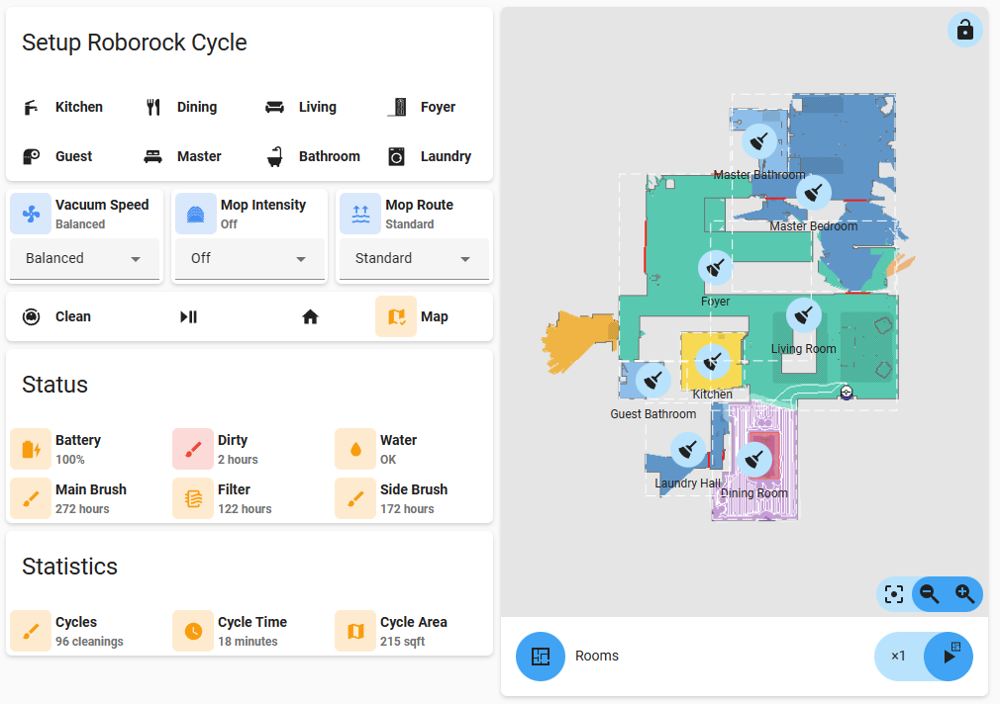
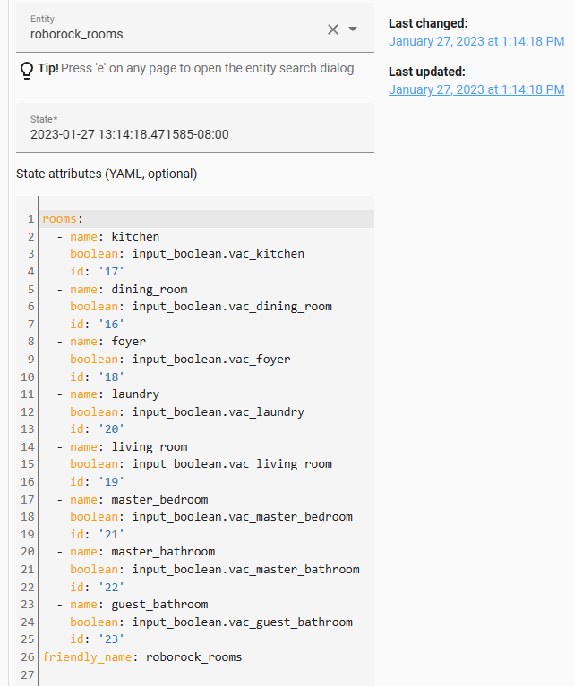
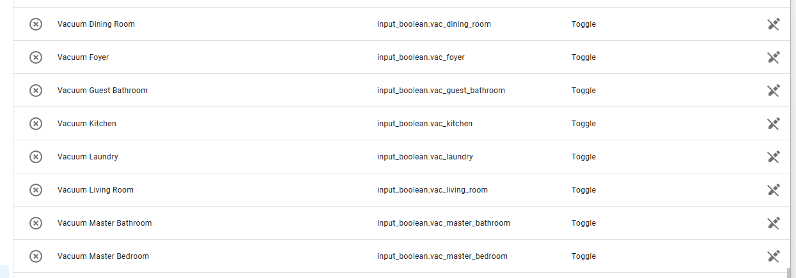
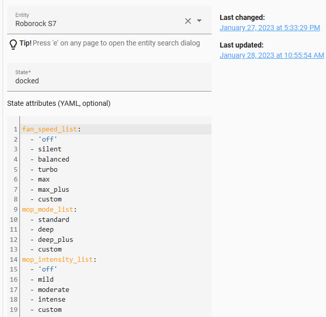
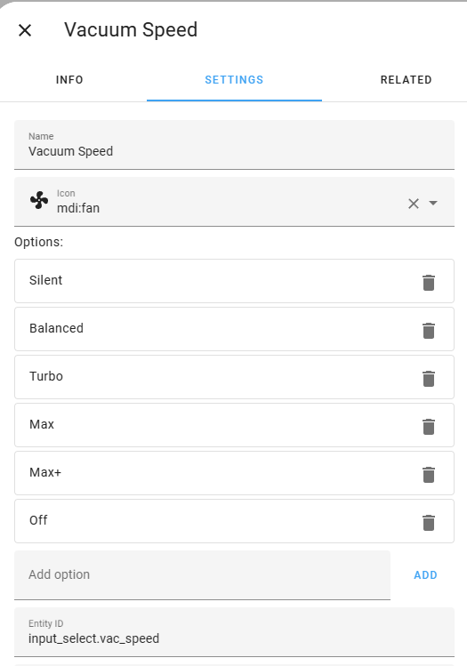

# Roborock  Home Assistant Interface 

I love my Roborock! SO I set out to put together an easy-to-use interface that allows for most all the common features one would need. And because I was in the process of converting all my GUI to [Mushroom](https://github.com/piitaya/lovelace-mushroom), most everything takes advantage of the Mushroom interface. 

## Final Result

I always like to give you a glance at what you are building first. This helps you to understand the components and what goes into the solution. What we are building is shown here:



There are several components and ideas here. 
The map (which is shown in the image above) can be shown/hidden. 
The room list is configured through a JSON file once you have you mapping configured.
The automation to clean the rooms allows you to pass in several rooms which will be cleaned (not just a single room).
The status area gives you some hints about things you may need to do (of course, more automations could be added to send notifications when needed.


## Prerequisites

I choose to use the new Roborock integration and not the Xiaomi integration except of course for the map component. Although, I will say that I almost never use the map component except through the Roborock app on my phone (and even then, rarely at all now that it is setup). This is not going to get into the setup of either of these, it assumes you have already installed these components and have them functioning.

As for the GUI, there are of course some standard cards like horizontal-stack and vertical-stack. But there are also several custom cards used. These include:

- [Mushroom](https://github.com/piitaya/lovelace-mushroom)
- [Stack-in Card](https://github.com/custom-cards/stack-in-card)
- [State Switch](https://github.com/thomasloven/lovelace-state-switch)

If you want the solution to work as is, you will need to be sure you have these installed and working in your Lovelace configuration.

## Input Booleans for Rooms

Those that know my setups will know that I like to make extensive use of local JSON files to store information.
Usually these have information that should be available in the integrations but the developer's forgot.
Or sometimes they are there and I can't find where ... and better, they look at my "hacks" and modify their integration to have the type of information that is needed.

Well, in this case it sure would be nice to understand "rooms" and their "id" but alas, I could find it nowhere without running the command line tools that extracts the data. But considering this is someone one would rarely modify, I thought this is perfect for a JSON file and a sensor.
So for this, I create a JSON file from know information you can get from the map extractor (namely, the area name and it's id). I probably could have not added the name of the input_boolean as I could have built that from the name, but still things change as they grow:

```
{
    "rooms": [
        {
            "name": "kitchen",
            "boolean": "input_boolean.vac_kitchen",
            "id": "17"
            },
        {
            "name": "dining_room",
            "boolean": "input_boolean.vac_dining_room",
            "id": "16"
            },
        {
            "name": "foyer",
            "boolean": "input_boolean.vac_foyer",
            "id": "18"
            },
        {
            "name": "laundry",
            "boolean": "input_boolean.vac_laundry",
            "id": "20"
            },
        {
            "name": "living_room",
            "boolean": "input_boolean.vac_living_room",
            "id": "19"
            },
        {
            "name": "master_bedroom",
            "boolean": "input_boolean.vac_master_bedroom",
            "id": "21"
            },
        {
            "name": "master_bathroom",
            "boolean": "input_boolean.vac_master_bathroom",
            "id": "22"
            },
        {
            "name": "guest_bathroom",
            "boolean": "input_boolean.vac_guest_bathroom",
            "id": "23"
            }
    ]
}
```

NOTE: I would love to eliminate this from the setup, so if someone knows where I can find the name/id map that would be perfect.
I could not find it anywhere in the "huge" object created from the map. I only see that room names are all listed as "Null".
Then I created a sensor, that stores this information by reading that local JSON file:

```
##
## Roborock Rooms 
##
- platform: rest
  name: roborock_rooms
  resource: http://192.168.2.245:8123/local/Roborock/roborock.json
  value_template: "{{ now() }}"
  json_attributes:
    - rooms
```

So if you look at Developer's tools, you would see this once your sensor is working:



Then head on over to "Helpers" and create yourself those input_boolean's. For me, I would have these:



Now, you ask yourself why and I doing this? 
The answer will come later but ... as a teaser, it allows me to tick several rooms and send that to start a cleaning cycle and clean them all at once, depending on the state of the input_boolean.

## Input Selects for Vacuum and Mop

There are two options for creating Input Selects for the Vacuum (fan speed) and Mop (mop mode and intensity). 
One could choose a generic path that would read these from the vacuum.roborock_s7 sensor with home assistant starts or one could just create input_select's with the appropriate information.
I chose the later because in the first case (dynamic creation on home assistant starting) the list would naturally change and you previous selections would be gone.
And considering we would have automations when the input_select changes, it could trigger these automations.

You can easily get those lists by looking at the state of the vacumm as shown here:



I chose to ignore "custom" because heck, I had no idea what it meant anyway. I just used helpers to created three input selects. For example, for Vacuum Speed:



## Automations/Scripts

For Automations/Scripts, we will need to do something when 
we click "Clean", 
do something when any of the input_booleans for Vacuum Speed, Mop Route, Mop Intensity changes, 
reset things when we are done with a cleaning cycle

### Clean

In looking at the GUI, when we click clean, we want to start a cleaning cycle for every room we clicked.
So this as a Script would be like below. This essentially builds a list of all the room id's and passes that to "clean segment":

```
alias: Run Vacuum
sequence:
  - service: roborock.vacuum_clean_segment
    data_template:
      segments: |
        
        
          
            
            
          
        
        {{ vacrooms.roomid }}
    target:
      entity_id: vacuum.roborock_s7
mode: single
icon: mdi:robot-vacuum
```

### Changing Fan Speed, Mop Route or Mop Intensity

This Automation triggers when any of the input booleans changes. 
Note here that this could be vastly improved by using the Robock equivalent services.
I have listed that below in something I will do in the future.

```
alias: Set Vacuum Mode
description: ""
trigger:
  - platform: state
    entity_id:
      - input_select.vac_mop_intensity
      - input_select.vac_speed
      - input_select.vac_mop_route
condition: []
action:
  - choose:
      - conditions:
          - condition: template
            value_template: "{{trigger.entity_id == 'input_select.vac_mop_intensity'}}"
        sequence:
          - service: vacuum.send_command
            data:
              command: set_water_box_custom_mode
              params: |
                
                  {{ 200 }}
                
                  {{ 201 }}
                
                  {{ 202 }}
                
                  {{ 203}}
                
            target:
              entity_id: vacuum.roborock_s7
      - conditions:
          - condition: template
            value_template: "{{trigger.entity_id == 'input_select.vac_mop_route'}}"
        sequence:
          - service: vacuum.send_command
            data:
              command: set_mop_mode
              params: |
                
                  {{ 300 }}
                
                  {{ 301 }}
                
                  {{ 303 }}
                
            target:
              entity_id: vacuum.roborock_s7
      - conditions:
          - condition: template
            value_template: "{{trigger.entity_id == 'input_select.vac_speed'}}"
        sequence:
          - service: vacuum.send_command
            data_template:
              command: set_custom_mode
              params: |
                
                  {{ 101 }}
                
                  {{ 102 }}
                
                  {{ 103 }}
                
                  {{ 104 }}
                
                  {{ 105 }}
                
                  {{ 100 }}
                
            target:
              entity_id: vacuum.roborock_s7
mode: single

```

### Reset after a Cleaning

After a cleaning cycle finishes, we should de-select the rooms in the interface.
I choose to trigger the reset when the vacuum enters a state of "returning":

```
alias: Reset Vacuum Rooms
description: ""
trigger:
  - platform: state
    entity_id:
      - vacuum.roborock_s7
    to: returning
condition: []
action:
  - service: homeassistant.turn_off
    data: {}
    target:
      entity_id:
        - input_boolean.vac_dining_room
        - input_boolean.vac_foyer
        - input_boolean.vac_guest_bathroom
        - input_boolean.vac_kitchen
        - input_boolean.vac_laundry
        - input_boolean.vac_living_room
        - input_boolean.vac_master_bathroom
        - input_boolean.vac_master_bedroom
mode: single
```

## Lovelace Card

Putting that all together, here are the cards. This first one is the Roborock interface.
The second one is a separate conditional card that displays the map only when you check the map boolean.

```
type: vertical-stack
cards:
  - type: custom:stack-in-card
    title: Setup Roborock Cycle
    cards:
      - type: horizontal-stack
        cards:
          - type: custom:mushroom-template-card
            primary: Kitchen
            secondary: ''
            icon: mdi:faucet
            icon_color: |
              
                orange
              
                gray
              
            entity: input_boolean.vac_kitchen
            tap_action:
              action: toggle
            hold_action:
              action: none
            double_tap_action:
              action: none
          - type: custom:mushroom-template-card
            primary: Dining
            secondary: ''
            icon: phu:rooms-dining
            icon_color: |
              
                orange
              
                gray
              
            entity: input_boolean.vac_dining_room
            tap_action:
              action: toggle
            hold_action:
              action: none
            double_tap_action:
              action: none
          - type: custom:mushroom-template-card
            primary: Living
            secondary: ''
            icon: phu:rooms-living
            icon_color: |
              
                orange
              
                gray
              
            entity: input_boolean.vac_living_room
            tap_action:
              action: toggle
            hold_action:
              action: none
            double_tap_action:
              action: none
          - type: custom:mushroom-template-card
            primary: Foyer
            secondary: ''
            icon: phu:panel-frontdoor-close
            icon_color: |
              
                orange
              
                gray
              
            entity: input_boolean.vac_foyer
            tap_action:
              action: toggle
            hold_action:
              action: none
            double_tap_action:
              action: none
      - type: horizontal-stack
        cards:
          - type: custom:mushroom-template-card
            primary: Guest
            secondary: ''
            icon: mdi:paper-roll
            icon_color: |
              
                orange
              
                gray
              
            entity: input_boolean.vac_guest_bathroom
            tap_action:
              action: toggle
            hold_action:
              action: none
            double_tap_action:
              action: none
          - type: custom:mushroom-template-card
            primary: Master
            secondary: ''
            icon: phu:rooms-bedroom
            icon_color: |
              
                orange
              
                gray
              
            entity: input_boolean.vac_master_bedroom
            tap_action:
              action: toggle
            hold_action:
              action: none
            double_tap_action:
              action: none
          - type: custom:mushroom-template-card
            primary: Bathroom
            secondary: ''
            icon: phu:rooms-bathroom
            icon_color: |
              
                orange
              
                gray
              
            entity: input_boolean.vac_master_bathroom
            tap_action:
              action: toggle
            hold_action:
              action: none
            double_tap_action:
              action: none
          - type: custom:mushroom-template-card
            primary: Laundry
            secondary: ''
            icon: phu:rooms-laundry-room
            icon_color: |
              
                orange
              
                gray
              
            entity: input_boolean.vac_laundry
            tap_action:
              action: toggle
            hold_action:
              action: none
            double_tap_action:
              action: none
  - type: horizontal-stack
    cards:
      - type: custom:mushroom-select-card
        entity: input_select.vac_speed
      - type: custom:mushroom-select-card
        entity: input_select.vac_mop_intensity
      - type: custom:mushroom-select-card
        entity: input_select.vac_mop_route
  - type: custom:stack-in-card
    cards:
      - type: horizontal-stack
        cards:
          - type: custom:state-switch
            entity: vacuum.roborock_s7
            default: default
            states:
              cleaning:
                type: custom:mushroom-template-card
                primary: Cleaning
                secondary: ''
                icon: mdi:robot-vacuum
                icon_color: orange
                tap_action:
                  action: none
                hold_action:
                  action: none
                double_tap_action:
                  action: none
                layout: horizontal
              default:
                type: custom:mushroom-template-card
                primary: Clean
                secondary: ''
                icon: mdi:robot-vacuum
                icon_color: >
                  

                  
                    
                      
                    
                  

                  
                    green
                  
                    gray
                  
                tap_action:
                  action: call-service
                  service: script.run_vacuum
                  data: {}
                  target: {}
                hold_action:
                  action: none
                double_tap_action:
                  action: none
                layout: horizontal
          - type: custom:state-switch
            entity: vacuum.roborock_s7
            default: default
            states:
              cleaning:
                type: custom:mushroom-template-card
                entity_id: vacuum.roborock_s7
                primary: Pause
                secondary: ''
                icon: mdi:play-pause
                icon_color: red
                tap_action:
                  action: call-service
                  service: vacuum.pause
                  data: {}
                  target:
                    entity_id: vacuum.roborock_s7
                hold_action:
                  action: call-service
                  service: vacuum.pause
                  data: {}
                  target:
                    entity_id: vacuum.roborock_s7
                double_tap_action:
                  action: none
                layout: horizontal
              returning:
                type: custom:mushroom-template-card
                entity_id: vacuum.roborock_s7
                primary: Returning
                secondary: ''
                icon: mdi:play-pause
                icon_color: red
                tap_action:
                  action: call-service
                  service: vacuum.pause
                  data: {}
                  target:
                    entity_id: vacuum.roborock_s7
                hold_action:
                  action: call-service
                  service: vacuum.pause
                  data: {}
                  target:
                    entity_id: vacuum.roborock_s7
                double_tap_action:
                  action: none
                layout: horizontal
              paused:
                type: custom:mushroom-template-card
                entity_id: vacuum.roborock_s7
                primary: Resume
                secondary: ''
                icon: mdi:play-pause
                icon_color: green
                tap_action:
                  action: call-service
                  service: vacuum.start
                  data: {}
                  target:
                    entity_id: vacuum.roborock_s7
                hold_action:
                  action: call-service
                  service: vacuum.start
                  data: {}
                  target:
                    entity_id: vacuum.roborock_s7
                double_tap_action:
                  action: none
                layout: horizontal
              default:
                type: custom:mushroom-template-card
                entity_id: vacuum.roborock_s7
                primary: ''
                secondary: ''
                icon: mdi:play-pause
                icon_color: gray
                tap_action:
                  action: none
                hold_action:
                  action: none
                double_tap_action:
                  action: none
                layout: horizontal
          - type: custom:state-switch
            entity: vacuum.roborock_s7
            default: default
            states:
              cleaning:
                type: custom:mushroom-template-card
                primary: Dock
                secondary: ''
                icon: mdi:home
                icon_color: orange
                tap_action:
                  action: call-service
                  service: vacuum.return_to_base
                  data: {}
                  target:
                    entity_id: vacuum.roborock_s7
                hold_action:
                  action: call-service
                  service: vacuum.pause
                  data: {}
                  target:
                    entity_id: vacuum.roborock_s7
                double_tap_action:
                  action: none
                layout: horizontal
              returning:
                type: custom:mushroom-template-card
                primary: Returning
                secondary: ''
                icon: mdi:home
                icon_color: gray
                tap_action:
                  action: none
                hold_action:
                  action: none
                double_tap_action:
                  action: none
                layout: horizontal
              idle:
                type: custom:mushroom-template-card
                primary: ''
                secondary: ''
                icon: mdi:home
                icon_color: orange
                tap_action:
                  action: call-service
                  service: vacuum.return_to_base
                  data: {}
                  target:
                    entity_id: vacuum.roborock_s7
                hold_action:
                  action: call-service
                  service: vacuum.pause
                  data: {}
                  target:
                    entity_id: vacuum.roborock_s7
                double_tap_action:
                  action: none
                layout: horizontal
              default:
                type: custom:mushroom-template-card
                primary: ''
                secondary: ''
                icon: mdi:home
                icon_color: gray
                tap_action:
                  action: none
                hold_action:
                  action: none
                double_tap_action:
                  action: none
                layout: horizontal
          - type: custom:mushroom-template-card
            primary: Map
            secondary: ''
            icon: mdi:map-check
            icon_color: |
              
                orange
              
                gray
              
            entity: input_boolean.show_roborock_map
            tap_action:
              action: toggle
            hold_action:
              action: none
            double_tap_action:
              action: none
            layout: horizontal
  - type: custom:stack-in-card
    title: Status
    cards:
      - type: horizontal-stack
        cards:
          - type: custom:mushroom-template-card
            entity: vacuum.roborock_s7
            primary: Battery
            secondary: '{{state_attr(entity,"battery")}}%'
            icon: |
              {{state_attr('vacuum.roborock_s7','battery_icon')}}
            icon_color: >
              
                orange
              
                blue
              
          - type: custom:mushroom-template-card
            entity: sensor.roborock_s7_sensor_dirty_left
            primary: Dirty
            secondary: |
              {{ ((states(entity) | int ) / 3600) | round(0)  }} hours
            icon: mdi:brush
            icon_color: |
              
                red
              
                orange
              
          - type: custom:mushroom-template-card
            entity: vacuum.roborock_s7
            primary: Water
            secondary: |
              
                Fill
              
                OK
              
            icon: mdi:water
            icon_color: |
              
                red
              
                orange
              
      - type: horizontal-stack
        cards:
          - type: custom:mushroom-template-card
            entity: sensor.roborock_s7_main_brush_left
            primary: Main Brush
            secondary: |
              {{ ((states(entity) | int ) / 3600) | round(0)  }} hours
            icon: mdi:brush
            icon_color: |
              
                red
              
                orange
              
          - type: custom:mushroom-template-card
            entity: sensor.roborock_s7_filter_left
            icon: mdi:air-filter
            primary: Filter
            secondary: |
              {{ ((states(entity) | int ) / 3600) | round(0)  }} hours
            icon_color: |
              
                red
              
                orange
              
          - type: custom:mushroom-template-card
            entity: sensor.roborock_s7_side_brush_left
            icon: mdi:brush
            primary: Side Brush
            secondary: |
              {{ ((states(entity) | int ) / 3600) | round(0)  }} hours
            icon_color: |
              
                red
              
                orange
              
  - type: custom:stack-in-card
    title: Statistics
    cards:
      - type: horizontal-stack
        cards:
          - type: custom:mushroom-template-card
            entity: sensor.roborock_s7_total_clean_count
            primary: Cycles
            secondary: |
              {{ ((states(entity) | int )) | round(0)  }} cleanings
            icon: mdi:brush
            icon_color: orange
          - type: custom:mushroom-template-card
            entity: vacuum.roborock_s7
            primary: Cycle Time
            secondary: >
              {{ ((state_attr(entity,'clean_time') | int ) / 60) | round(0)  }}
              minutes
            icon: mdi:clock
            icon_color: orange
          - type: custom:mushroom-template-card
            entity: vacuum.roborock_s7
            primary: Cycle Area
            secondary: >
              {{ ((state_attr(entity,'clean_area') | int ) / 92903) | round(0) 
              }} sqft
            icon: mdi:map
            icon_color: orange

```

Note here I have set tiles and icons to null as I never use them as they have the same information as the interface.

```
type: conditional
conditions:
  - entity: input_boolean.show_roborock_map
    state: 'on'
card:
  type: custom:xiaomi-vacuum-map-card
  tiles: []
  icons: []
  map_source:
    camera: camera.roborock_s7_map
  calibration_source:
    camera: true
  entity: vacuum.roborock_s7
  vacuum_platform: default
  map_modes:
    - template: vacuum_clean_segment
      predefined_selections:
        - id: 16
          icon:
            name: mdi:broom
            x: 20725
            'y': 21475
          label:
            text: Dining Room
            x: 20725
            'y': 21475
            offset_y: 35
          outline:
            - - 18500
              - 18300
            - - 22950
              - 18300
            - - 22950
              - 24650
            - - 18500
              - 24650
        - id: 17
          icon:
            name: mdi:broom
            x: 18500
            'y': 26725
          label:
            text: Kitchen
            x: 18500
            'y': 26725
            offset_y: 35
          outline:
            - - 16800
              - 25200
            - - 20200
              - 25200
            - - 20200
              - 28250
            - - 16800
              - 28250
        - id: 18
          icon:
            name: mdi:broom
            x: 18650
            'y': 31725
          label:
            text: Foyer
            x: 18650
            'y': 31725
            offset_y: 35
          outline:
            - - 13550
              - 26750
            - - 23750
              - 26750
            - - 23750
              - 36700
            - - 13550
              - 36700
        - id: 19
          icon:
            name: mdi:broom
            x: 23350
            'y': 29150
          label:
            text: Living Room
            x: 23350
            'y': 29150
            offset_y: 35
          outline:
            - - 18400
              - 24100
            - - 28300
              - 24100
            - - 28300
              - 34200
            - - 18400
              - 34200
        - id: 20
          icon:
            name: mdi:broom
            x: 17175
            'y': 22025
          label:
            text: Laundry Hall
            x: 17175
            'y': 22025
            offset_y: 35
          outline:
            - - 14950
              - 19550
            - - 19400
              - 19550
            - - 19400
              - 24500
            - - 14950
              - 24500
        - id: 21
          icon:
            name: mdi:broom
            x: 23875
            'y': 35700
          label:
            text: Master Bedroom
            x: 23875
            'y': 35700
            offset_y: 35
          outline:
            - - 19550
              - 30450
            - - 28200
              - 30450
            - - 28200
              - 40950
            - - 19550
              - 40950
        - id: 22
          icon:
            name: mdi:broom
            x: 21000
            'y': 38450
          label:
            text: Master Bathroom
            x: 21000
            'y': 38450
            offset_y: 35
          outline:
            - - 19450
              - 36750
            - - 22550
              - 36750
            - - 22550
              - 40150
            - - 19450
              - 40150
        - id: 23
          icon:
            name: mdi:broom
            x: 15350
            'y': 25700
          label:
            text: Guest Bathroom
            x: 15350
            'y': 25700
            offset_y: 35
          outline:
            - - 13550
              - 24700
            - - 17150
              - 24700
            - - 17150
              - 26700
            - - 13550
              - 26700
    - template: vacuum_clean_zone
    - template: vacuum_goto

```


## Next Steps

- Maybe find an alternate approach to getting room name/id assignment like possibly a command line sensor or extract the data from the card (which seems so wrong!)
- Implement resetting sensors after cleaning/replacement
- Redo automations for Vacuum and Mop to use the Roborock equivalents and not the numeric, generic vacuum ones


